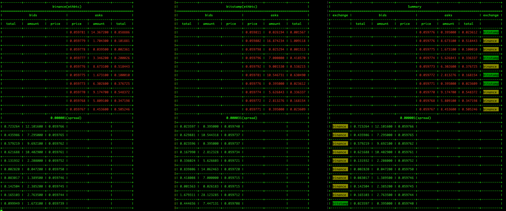

# grpc-stream-merged-order-books



## Keyword
```
cryptocurrency, orderbook, spread, binance, bitstamp,
rust, cli, websocket, grpc, tokio, tungstenite, tonic, serde, tracing, anyhow
```
## What is this project doing ?
Getting order books from binance and bitstamp and forward them to inner grpc-server. One then can subscribe from grpc to see a merged summary of those orderbooks 

## Download project
```bash
    git clone https://gitlab.com/it-is-not-possible.-no-it-is-necessary/grpc-stream-merged-order-books.git
```

# Install Rust
```bash
    curl --proto '=https' --tlsv1.2 -sSf https://sh.rustup.rs | sh
```

## How to run
1. run grpc
```bash
    cargo run --release --bin server 
```
2. run binance with symbol "ethbtc" and display received orderbook with decimal point up to 6  
```bash
    cargo run --release --bin binance-client -- --symbol "ethbtc" --display  -p 6
```
3. run bitstamp with symbol "ethbtc" and display received orderbook with decimal point up to 6  
```bash
    cargo run --release --bin bitstamp-client -- --symbol "ethbtc" --display  -p 6
```
4. run subscribe
```bash
    cargo run --release --bin client -- --subscribe 
```

## Roadmap
1. Users can subscrie from different exchanges (knapsack algo perhaps)
2. Support other exchanges
3. Graceful shutdown
4. Performance test
5. Minor:
    - CI
    - Dockerize
    - Merge binance-client and bitstamp-client cause they shared most of implementation logic

## Special thanks (sort by name)
1. Kushal
2. Michael Wong
3. Robbie Davenport 

## Project status
It's an on-going project
